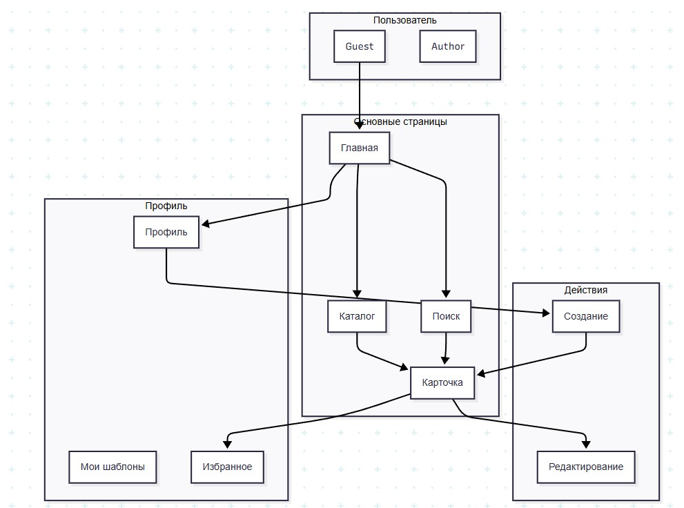
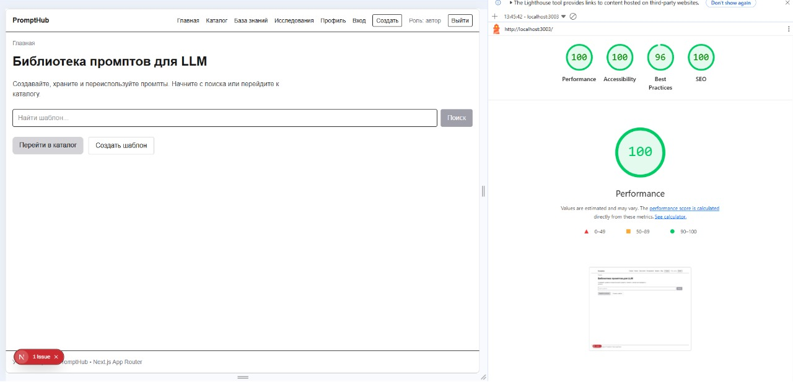

# PromptHub

Учебный сервис для создания, поиска, редактирования и переиспользования промптов для LLM.

## Демо

Ссылка: локальный запуск `http://localhost:3000`

## Описание проекта

Платформа содержит каталог шаблонов, детальные карточки промптов, поиск с URL-параметрами, создание/редактирование шаблонов и профиль пользователя. В проекте реализована реактивная mock-авторизация с сохранением роли в `localStorage`.

## Стек технологий

- Next.js App Router
- React 19 + TypeScript
- Tailwind CSS
- React Hook Form + Zod
- Jest + React Testing Library
- Playwright (E2E)
- Кастомная подсветка PromptEditor (regex)

## Инструкция запуска

```bash
npm install
npm run dev
```

Приложение доступно по адресу [http://localhost:3000](http://localhost:3000).

Дополнительные команды:

```bash
npm run build
npm run test
npm run test -- --coverage
```

## Пользовательские сценарии

1. Поиск через главную страницу: ввод запроса -> переход на `/search?query=...` -> просмотр результатов.
2. Создание шаблона: вход на `/login` -> переход на `/create` -> заполнение формы с `PromptEditor` -> сохранение.
3. Работа с карточкой: открытие шаблона -> копирование или добавление в избранное -> переход в профиль.
4. Редактирование собственного шаблона: переход из карточки в edit-режим -> сохранение изменений.

## Роли пользователей

- `guest`:
  - просмотр каталога и карточек
  - поиск и подсказки
  - без доступа к созданию шаблонов
- `author`:
  - создание и редактирование своих шаблонов
  - добавление в избранное
  - создание копий шаблонов

Роль хранится в централизованном реактивном хранилище `authStore` (`src/lib/auth-store.ts`) и восстанавливается после refresh из `localStorage`.

## PromptEditor

Кастомная подсветка синтаксиса в `PromptEditor` реализована через regex для упрощения и контроля формата.

Поддерживаемые конструкции:
- заголовки `## Heading`
- стрелки `→`
- XML-теги `<tag>`
- переменные `{{variable}}`
- CAPS-акценты
- inline-code `` `code` ``
- JSON-пары `"key": "value"`
- декораторы `+++Format`
- MetaGlyph: `∈ ∩ ∪ ¬ → ⊕`

## Архитектура

- App Router (Next.js)
- Разделение на страницы `src/app` и переиспользуемые UI-компоненты `src/components`
- Централизованные store:
  - `promptStore` для промптов/поиска/избранного
  - `authStore` для роли пользователя и авторизации

## Тестирование

- Unit: Jest
- Integration: React Testing Library
- E2E: Playwright

Покрытие: ~81%

## Диаграмма



## Lighthouse Report

Аудит выполнен через DevTools.

### Catalog


### Create


### Edit


### Main
